<div align="center">

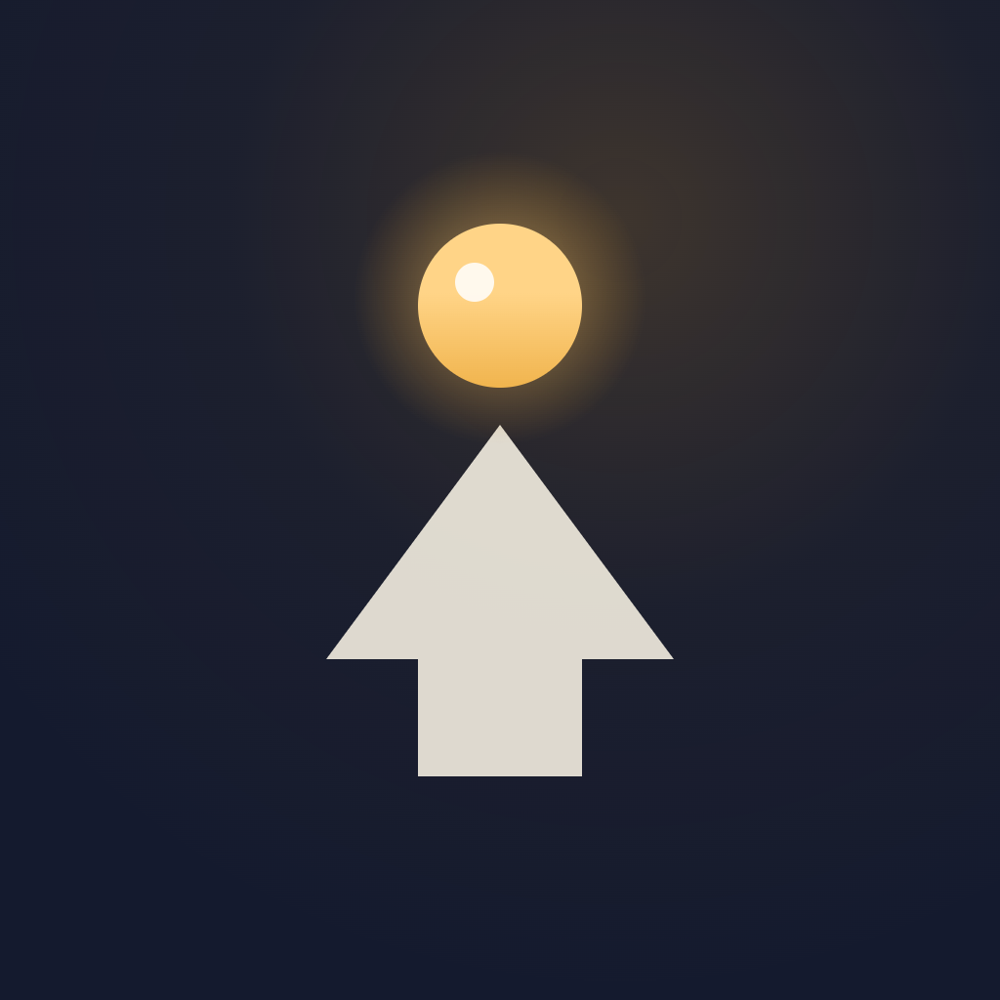

# Enitor

**A paper journal for people who actually want to get things done.**

Tasks, goals, and honest productivity stats — cross-platform, fully local, no account required.

[](#)
[](#)
[](LICENSE)
[](#)
[](https://github.com/alexskvo10/Enitor/releases/latest)

</div>

---

## Why Enitor

Most productivity apps aim for one thing: stay out of your way. Log a task, check it off, forget it. Enitor is built on a different premise — **staying out of your way isn't the goal, getting better is.** A task list is only useful if it eventually shows you something about yourself: that you're more consistent than you think, that your estimates are always 20% short, that Tuesdays are where you fall off. Enitor is designed to surface that, not hide it behind a clean checklist.

Concretely, not as slogans:

- **A quote about discipline, not decoration.** Every day on the Today screen opens with a line pulled from a curated collection about showing up and improving in small increments ("Compare yourself to who you were yesterday, not to who someone else is today.") — not filler, the same idea the rest of the app is built around.
- **Streaks that are actually fair, so they're worth keeping.** Days with no tasks neither break nor pad your streak, and today (while still open) never breaks it either — a streak here means something, so chasing it is a legitimate motivator, not a guilt trip.
- **A year you can actually see.** A GitHub-style heatmap turns months of effort into one glance — the kind of feedback that makes consistency feel real instead of abstract.
- **A weekly retrospective that asks "how did it go," not just "what's next."** Productivity delta vs. last week, your best day, perfect days, an optional 1–10 day rating — a five-minute check-in that turns a busy week into something you actually learn from, instead of just rolling into the next one.
- **Estimate accuracy that quietly makes you better at planning.** Planned vs. actual time, shown both by task count and by time weight, broken down by tag — most trackers never close this loop, so you never learn you're always 20% short.
- **Pomodoro that feeds that same loop.** A completed focus session logs itself as real time spent on the task — it's not a separate stopwatch gimmick, it's more data for the estimate-accuracy picture above.
- **Achievements that track real progress**, not just "opened the app" streaks — volume, consistency, punctuality, and milestones, so unlocking one actually means something happened, not that a day passed. Top-tier ones are hidden as "???" until you earn them, so there's always a next one worth finding out about.

And the fundamentals that make trusting it with your habits worthwhile:

- **Carry-over is never silent.** At the 4:00 AM day boundary Enitor *asks* what to carry over, creates a fresh copy on today, and leaves the original in its own day with a small arrow badge. History is never rewritten — your past stays exactly as it happened, which is what makes the stats above trustworthy in the first place.
- **The calendar won't guilt-trip you.** Days with no tasks are neutral, not red. An empty *future* day is blue, not red — there's a real difference between "you did nothing" and "you haven't gotten there yet."
- **The day starts at 4:00, not midnight.** If you're up late finishing something, your "today" doesn't flip under your feet at 00:00 and quietly mark it "yesterday's task, done late" — late-night hours still belong to the day that's ending, so the one time you actually push through doesn't get punished by the calendar.
- **A design system, not a coat of paint.** Warm "paper" surfaces, ink-colored shadows, a single sparing accent color, a spring-eased checkbox stroke that *draws itself* — every choice answers to one consistent metaphor ("a paper journal"), documented down to the hex code in [`docs/design-overview.md`](docs/design-overview.md).
- **Genuinely yours.** No account, no cloud, no telemetry. Everything lives in local storage; a manual export/import covers backups and device migration. The app also checks GitHub for new releases and updates itself — no store gatekeeping, no forced updates.
- **One codebase, two real platforms.** Windows and Android from a single Flutter codebase — not a phone app with a resized desktop wrapper, both get the same features, the same design, and fixes at the same time. Fully localized in Russian and English with an instant, no-restart language switch.

---

## Table of contents

- [Screenshots](#screenshots)
- [Installation](#installation)
- [Features](#features)
- [Design](#design)
- [Tech stack](#tech-stack)
- [Development setup](#development-setup)
- [Architecture](#architecture)
- [Project structure](#project-structure)
- [Tests](#tests)
- [License](#license)

---

## Screenshots

From the Windows build, on the generated demo data (`scripts/generate_demo_backup.dart`) rather than a real personal task list.

<table>
<tr>
  <td width="33%">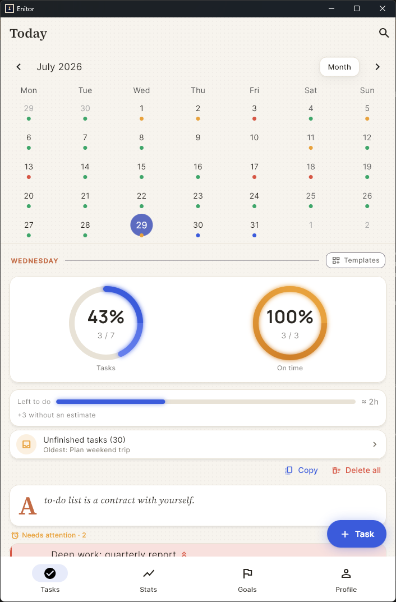<br/><sub>Today — a month at a glance with one colour dot per day, completion rings, and the day's remaining time budget</sub></td>
  <td width="33%">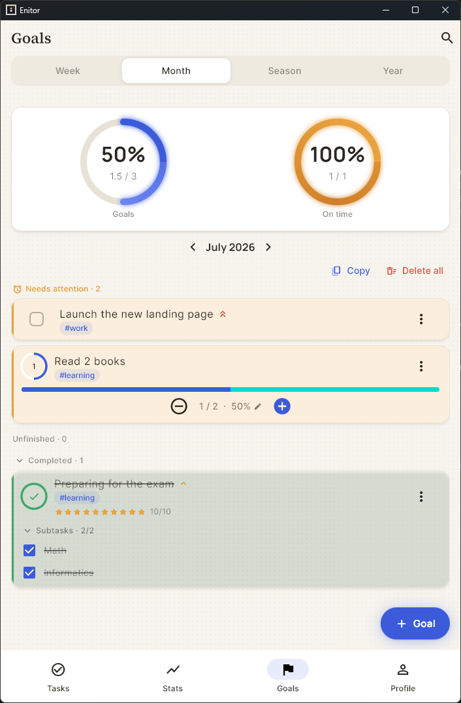<br/><sub>Goals — week / month / season / year, with counter progress and subtasks</sub></td>
  <td width="33%">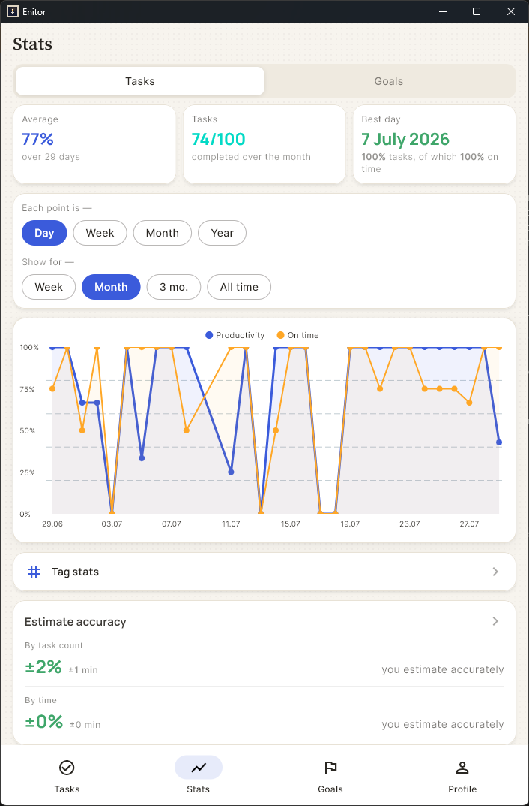<br/><sub>Statistics — productivity against on-time, any granularity and range, plus estimate accuracy</sub></td>
</tr>
<tr>
  <td width="33%">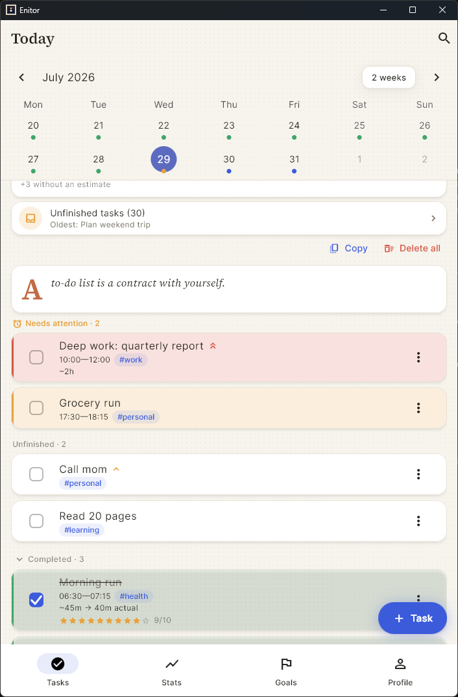<br/><sub>The list itself — needs attention, unfinished, completed with time spent and a rating</sub></td>
  <td width="33%">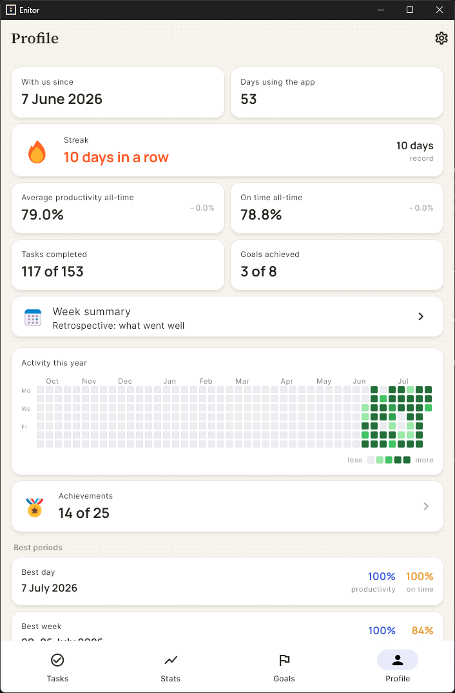<br/><sub>Profile — streak, all-time averages, year heatmap, achievements</sub></td>
  <td width="33%">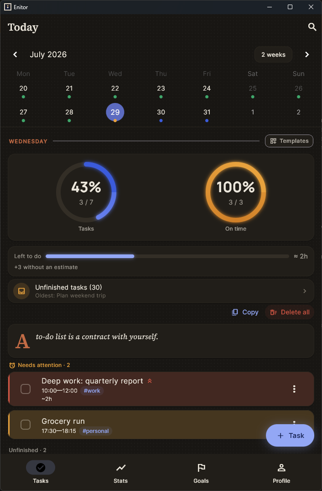<br/><sub>Dark theme — the same day on warm charcoal, not blue-grey</sub></td>
</tr>
</table>

<details>
<summary><b>More screens</b> — Pomodoro, carry-over, weekly retrospective, achievements, tag stats, settings</summary>

<table>
<tr>
  <td width="33%">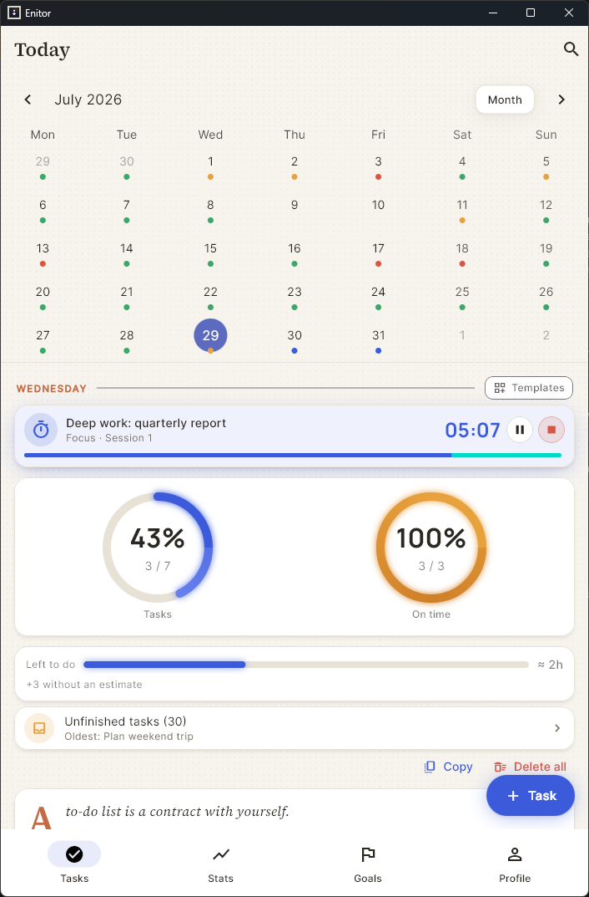<br/><sub>Pomodoro — the running session pins itself above the day, so the timer is never a screen you have to go find</sub></td>
  <td width="33%">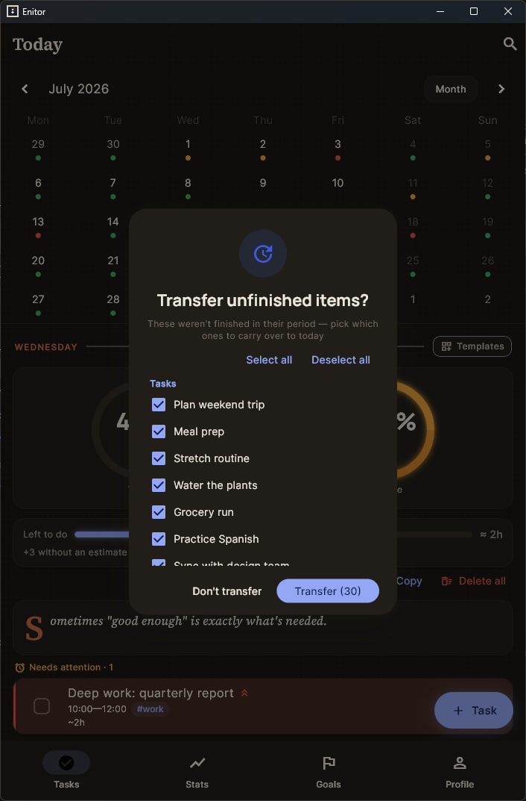<br/><sub>Carry-over at 4:00 — you pick what moves to today, nothing migrates silently</sub></td>
  <td width="33%">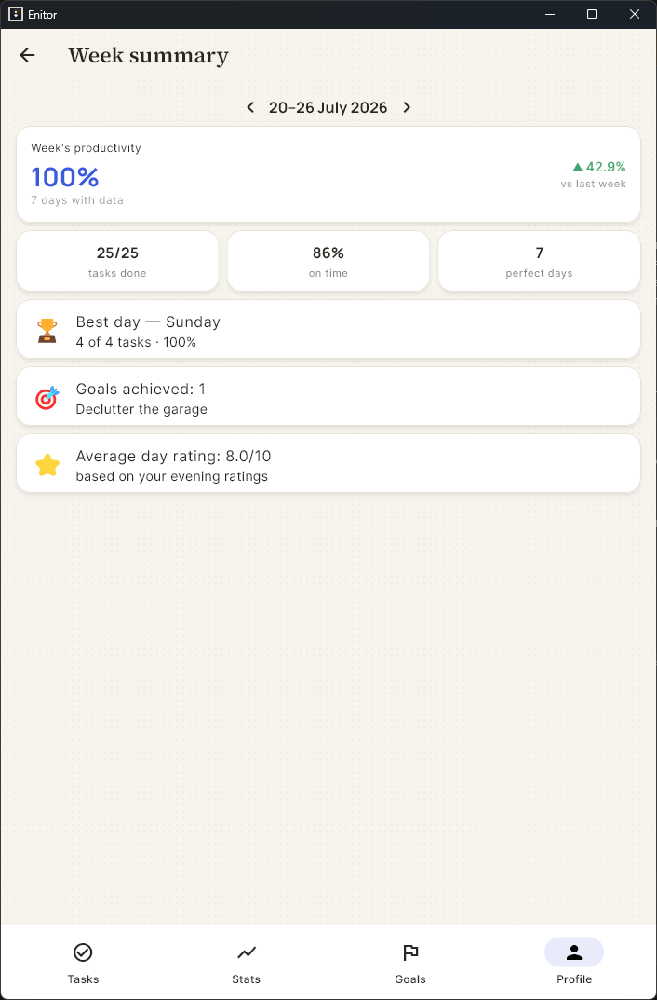<br/><sub>Weekly retrospective — this week against last, best day, goals achieved, average day rating</sub></td>
</tr>
<tr>
  <td width="33%">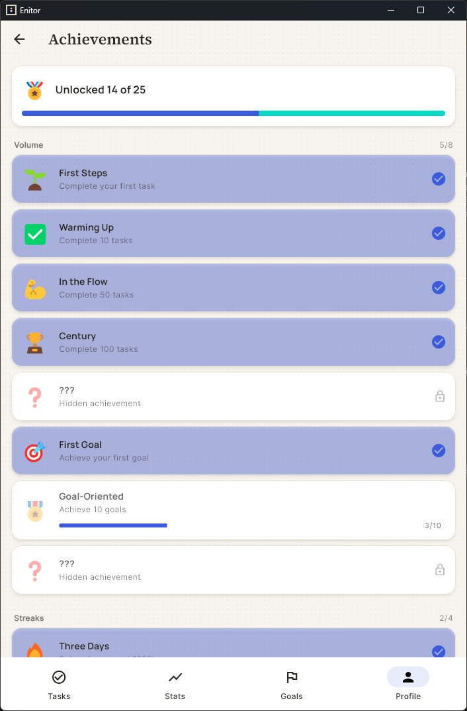<br/><sub>Achievements — 25 in all, some staying hidden until you unlock them</sub></td>
  <td width="33%">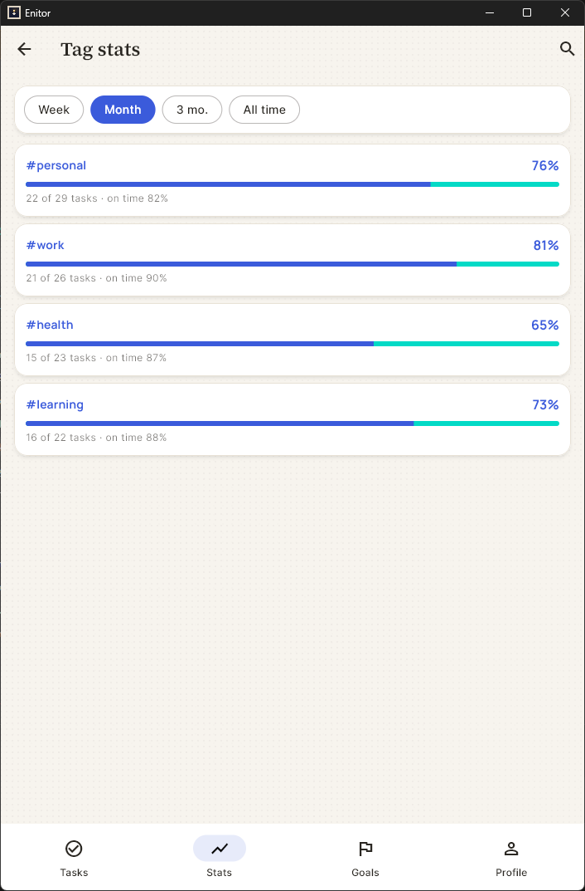<br/><sub>Tag stats — completion and punctuality per tag, so you can see which areas you actually keep up with</sub></td>
  <td width="33%">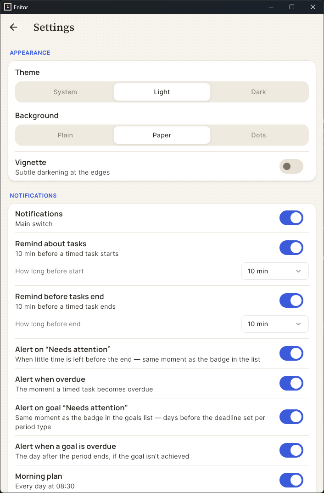<br/><sub>Settings — theme, paper texture, and every kind of notification toggled on its own</sub></td>
</tr>
</table>

</details>

---

## Installation

Grab the latest build from [Releases](https://github.com/alexskvo10/Enitor/releases/latest) — no build tools required.

- **Android**: download the `.apk`, open it, and allow installation from this source when prompted (the app isn't distributed through Google Play, so Android will ask once). Requires Android 5.0+.
- **Windows**: download the `.zip`, extract it anywhere, and run `enitor.exe`. No installer, no admin rights needed.

After the first install, Enitor checks GitHub for new releases on its own (about once a day) and offers to update itself — you won't need to come back here for routine updates.

> **Windows: add `enitor.exe` to your antivirus's trusted list.** Enitor ships unsigned, so security suites that sandbox unknown applications (Kaspersky and 360 Total Security both do) may redirect its registry writes into a shadow copy. That matters for one specific thing: to show a notification, Windows looks the app up under `HKCU\Software\Classes\AppUserModelId\Dev.Enitor.App.Desktop`, which Enitor writes on startup. If that write is redirected, the entry never reaches the real registry — and Windows then **silently discards every scheduled notification**, with no error anywhere. The app can't detect this on its own, because reading the value back returns the sandboxed copy. Everything else keeps working, which makes it a confusing failure: reminders simply never arrive.

---

## Features

### Tasks
- A rotating quote from a curated collection about discipline and small daily progress opens the Today screen — not a widget nobody asked for, the same idea the rest of the app is built around.
- Start/end time, priority, tags, sub-tasks (checklist), or a numeric counter ("drink 5 glasses of water") — partial progress counts honestly toward productivity.
- Recurring tasks (daily, by weekday, by day of month, or every N days), with a choice of how far ahead to generate.
- Copy a whole day's task set to another day, or save it as a reusable **template**.
- Global search across task titles, descriptions, and tags.

### Goals
- Four periods — week, month, season, year — with an optional deadline.
- A goal can be a checkbox, a counter/quota, or a checklist, and quota goals can auto-track linked tasks (e.g. "10 workouts this month").
- Priority and tags work the same way as for tasks, with dedicated tag statistics.
- Carrying an unfinished goal into the next period is one tap — always a copy, never a silent edit of the original.

### Carry-over, 4:00 rollover, and the backlog
- Unfinished tasks/goals from a past day are offered for carry-over, not force-moved — a top banner if the app is open, a catch-up checklist on next launch if it wasn't.
- If something is carried over and left undone *again*, it moves to the **backlog** instead of cluttering today's list — nothing is ever silently dropped.

### Statistics
- Productivity and on-time charts (day/week/month/year) for both tasks and goals, with a composite "best day/period" score that rewards a busy productive day over a single 100%-complete task.
- **Estimate accuracy**: planned vs. actual time, median-based, shown both by task count and by time weight, broken down by task size and by tag.
- **Goal deadline compliance** and tag-level breakdowns for both tasks and goals.

### Pomodoro
- 25 minutes of focus / 5 minutes of break, tied to a specific task. Switching tabs doesn't reset the countdown, and a completed session is logged straight into the task's actual time.

### Profile & achievements
- Daily streak (fair — empty days don't touch it), a GitHub-style year heatmap, a weekly retrospective with a productivity delta vs. last week.
- Optional daily mood/quality rating that feeds the weekly summary — purely reflective, it never affects productivity numbers.
- Achievement badges for volume, streaks, punctuality, and milestones; top-tier ones stay hidden as "???" until unlocked.

### Notifications
- Per-task start/end reminders, "needs attention," and overdue nudges, plus goal reminders, a morning plan, an evening review prompt, and quiet hours — every kind toggled independently in Settings.
- On Windows, if no notification ever arrives, see the antivirus note under [Installation](#installation) — a sandboxing security suite is the usual cause.

### Data & updates
- 100% local storage, no account, no telemetry. Manual JSON export/import for backups and moving between devices.
- Built-in self-update: checks GitHub Releases (throttled to once a day automatically, or on demand), shows the changelog, and installs itself — the system installer on Android, an automatic relaunch on Windows.

### Personalization
- Light / dark / system theme, three background styles (plain, paper grain, dot grid) with an optional vignette.
- Full Russian and English localization, switchable instantly without restarting.
- Desktop keyboard shortcuts (`Ctrl+N` to create, `Enter`/`Esc`/`Tab` in forms and dialogs).

---

## Design

The design follows the same idea as the feature set above: stay quiet everywhere so a task list doesn't become another source of noise, and spend that restraint on the few moments actually worth noticing.

Enitor isn't styled with default Material widgets — it follows a single, deliberate visual language called **"Living Paper"**: warm paper surfaces instead of stark white, ink-colored shadows instead of cold Material elevation, one sparing accent color instead of a rainbow of status colors, a thin 4px stripe plus a light background tint instead of a solid, fully-saturated fill so a busy list doesn't turn into a wall of colored blocks, and calm, human copy on empty/error states instead of alarming system text. Motion follows the same restraint: ordinary transitions use a calm, no-overshoot curve, and the "alive" spring-eased moments — a checkbox stroke that *draws itself*, a productivity ring that catches up with a slight overshoot, an achievement popup that pops and scatters sparks — are reserved specifically for finishing a task, hitting a streak, or unlocking a badge. The reward is real, but it only shows up when you've actually earned it.

Every color, timing, and component is documented — not as marketing copy, but as an actual spec — in [`docs/design-overview.md`](docs/design-overview.md).

---

## Tech stack

| Layer                | Technology                                    |
|-----------------------|-----------------------------------------------|
| UI / app               | Flutter (Dart)                                |
| State management        | Riverpod                                      |
| Navigation               | go_router                                    |
| Local storage             | SharedPreferences (JSON)                    |
| Charts                     | fl_chart                                    |
| Calendar                    | table_calendar                             |
| Notifications                 | flutter_local_notifications + timezone   |
| Self-update                     | GitHub Releases API + `archive`/`http`  |
| Localization                      | flutter_localizations + intl (ru, en) |

Data is stored locally as JSON via `SharedPreferences` — no cloud sync, no accounts. A manual backup export/import (`file_picker`) covers device migration and safety nets.

---

## Development setup

Building from source (not required just to use the app — see [Installation](#installation) for that). Detailed instructions in [docs/setup.md](docs/setup.md).

```bash
flutter pub get
flutter run -d windows     # run on Windows
flutter run -d <android>   # run on Android (device or emulator required)
```

---

## Architecture

Detailed description in [docs/architecture.md](docs/architecture.md).

In short: **feature-first** structure. Each feature (`today/`, `goals/`,
`stats/`, …) contains its own screens and providers. Shared layers —
`data/` (models + repositories), `core/` (theme, router, utils), `widgets/`
(reusable widgets), `services/` (notifications, updates).

## Project structure

```
Enitor/
├── lib/
│   ├── main.dart                 # entry point
│   ├── app.dart                  # root app widget
│   ├── core/                     # theme, router, constants, utils
│   ├── l10n/                     # ru + en translations
│   ├── data/
│   │   ├── models/                # Task, Goal, DayStats, Achievement, ...
│   │   └── repositories/          # business logic over local storage
│   ├── features/                 # screens, grouped by feature
│   │   ├── today/                # daily task list + calendar
│   │   ├── backlog/               # undated tasks
│   │   ├── goals/                 # goals
│   │   ├── stats/                 # charts and analytics
│   │   ├── retro/                 # retrospective
│   │   ├── achievements/          # achievements
│   │   ├── profile/               # profile
│   │   ├── templates/             # day task-set templates
│   │   ├── search/                # search
│   │   ├── settings/              # settings, notifications
│   │   ├── help/                  # FAQ
│   │   └── about/                 # about screen
│   ├── widgets/                  # shared widgets (productivity ring, etc.)
│   └── services/                 # notifications, updates
├── assets/
│   ├── fonts/
│   ├── icon/
│   └── quotes/                   # quote JSON files
├── test/
├── docs/
└── pubspec.yaml
```

## Tests

```bash
flutter test
```

---

## License

[MIT](LICENSE) © alexskvo10
